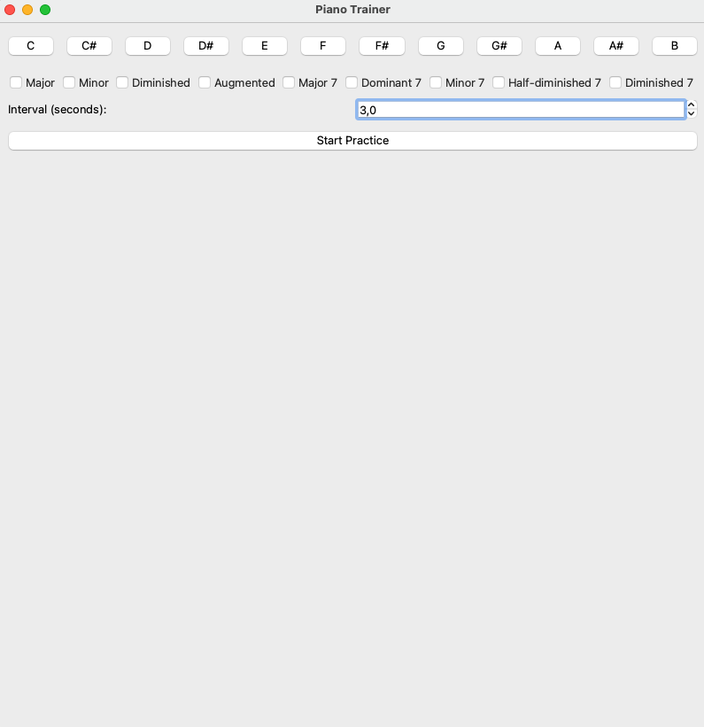
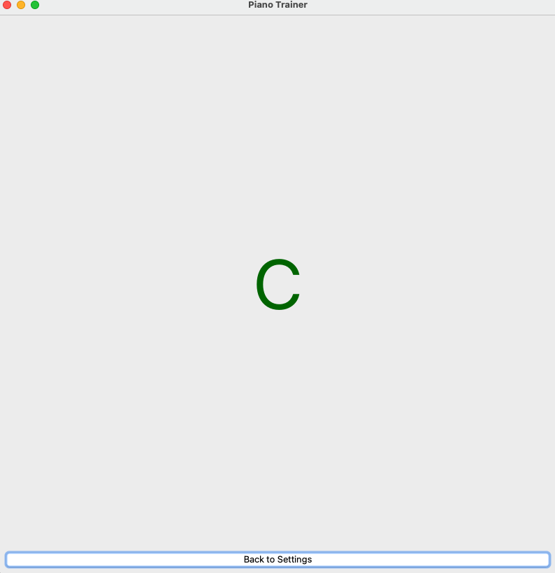
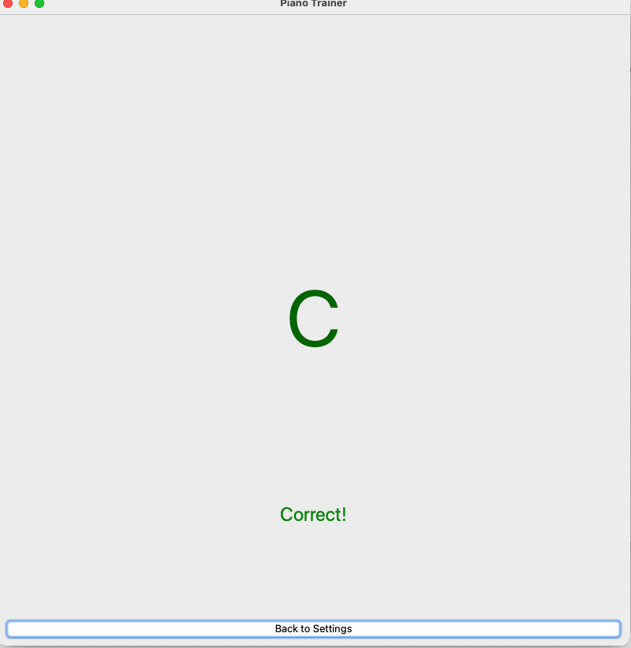

# Piano Chords Trainer

App to learn chords and chord progressions


## Run
Download the last version of the app at the [release section](https://github.com/ulisesrey/piano_chords/releases).
Right now only available for mac.

Alternatively, if you have uv installed and know how to clone a repo, just clone the repository, cd into it, and on the terminal write:
```
make run
```

## Tutorial
First of all, connect your keyboard to your laptop with a Midi cable.

Open the App. It might take some seconds to load.

You land on the settings page, which looks like this:


On it, you select the chords you want to practice, and the time interval.

After it click "Start practice".
You will see a screen like this:


If you click the keys that correspond to the chord you will see a message saying "Correct!".

If not, you will get a message saying: "Press all notes".


If you have any problem, please open an issue or contact me.

## Project Organization

```
├── docs # Docs are not ready yet
│   ├── docs
│   │   ├── getting-started.md
│   │   └── index.md
│   ├── mkdocs.yml
│   └── README.md
├── LICENSE
├── Makefile
├── piano_chords
│   ├── __init__.py
│   ├── chord_generator.py
│   ├── logo
│   │   ├── icon.icns
│   │   ├── icon.iconset
│   │   └── logo.png
│   ├── main.py
│   ├── midi_input.py
│   ├── pages
│   │   ├── practice_page.py
│   │   └── settings_page.py
│   └── test_midi.py
├── pyproject.toml
├── README.md
└── uv.lock
```


## Author
Ulises Rey