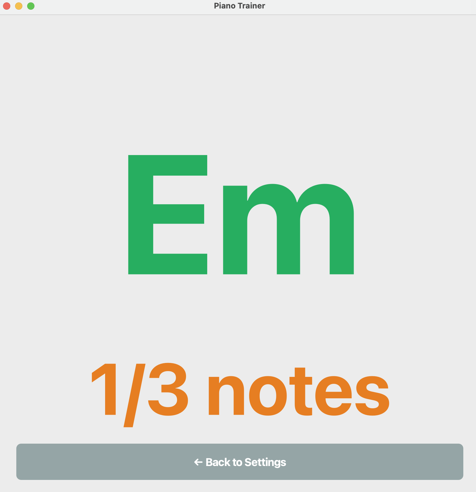

# Piano Chords Trainer

App to learn chords and chord progressions


## Run
Download the last version of the app at the [release section](https://github.com/ulisesrey/piano_chords/releases).
Right now only available for mac.

Alternatively, if you have uv installed and know how to clone a repo, just clone the repository, cd into it, and on the terminal write:
```
make run
```

## Tutorial
First of all, connect your keyboard to your laptop with a Midi cable.

Open the App. It might take some seconds to load.

You land on the settings page, which looks like this:


On it, you can either select a progression with its root (Option 1) or write the chords you want to practice. Setting page allows you to choose Random or not, and the time interval.

After it click "Start practice".
You will see a screen like this:


If you press the keys that correspond to the chord you will see a message saying "Correct!".

If not, you will get a message saying: "Press all notes".


If you have any problem, please open an issue or contact me.

## Project Organization

```
├── figures
│   ├── figure-1.png
│   ├── figure-2.png
│   ├── figure-3.png
│   └── figure-4.png
├── LICENSE
├── Makefile
├── piano_chords
│   ├── __init__.py
│   ├── __pycache__
│   │   ├── __init__.cpython-310.pyc
│   │   ├── chord_generator.cpython-310.pyc
│   │   └── midi_input.cpython-310.pyc
│   ├── chord_generator.py
│   ├── logo
│   │   ├── icon.icns
│   │   ├── icon.iconset
│   │   └── logo.png
│   ├── main.py
│   ├── midi_input.py
│   ├── pages
│   │   ├── __pycache__
│   │   ├── practice_page.py
│   │   └── settings_page.py
│   ├── progressions.yaml
│   └── test_midi.py
├── PianoTrainer.spec
├── pyproject.toml
├── README.md
├── test_chords.py
└── uv.lock
```


## Author
Ulises Rey